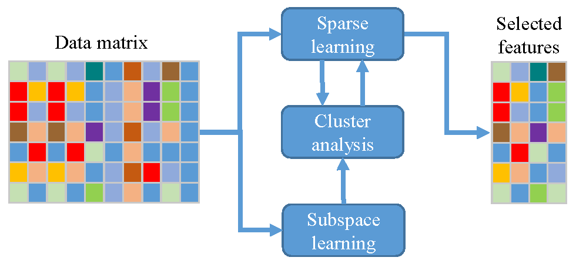
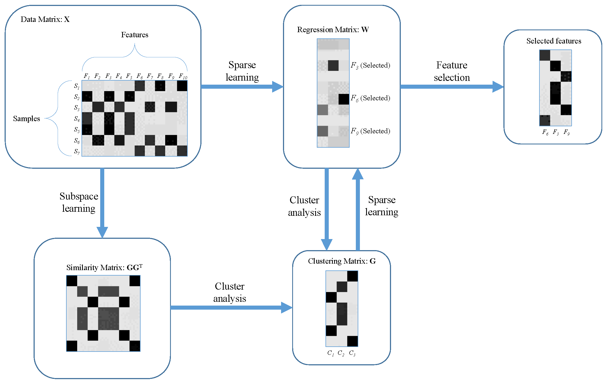

# SCFS: Subspace Clustering unsupervised Feature Selection

[](https://doi.org/10.1016/j.engappai.2020.103855)
[](https://doi.org/10.1016/j.engappai.2020.103855)

Official implementation of the paper:

**Unsupervised Feature Selection Based on Adaptive Similarity Learning and Subspace Clustering**

Published in *Engineering Applications of Artificial Intelligence (Elsevier)*, Volume 95, 2020.

Authors:

* Mohsen Ghassemi Parsa
* Hadi Zare
* Mehdi Ghatee

---

# Keywords

Unsupervised Feature Selection, Feature Selection, Subspace Clustering, Adaptive Similarity Learning, Representation Learning, Sparse Learning, Dimensionality Reduction, Data Mining, Machine Learning, Clustering, High-Dimensional Data Analysis.

---

# If You Use This Code, Please Cite the Paper

This repository accompanies a peer-reviewed journal publication.

If SCFS contributes to your research, experiments, benchmark comparisons, or software, please cite:

```bibtex
@article{Parsa2020SCFS,
  title={Unsupervised Feature Selection Based on Adaptive Similarity Learning and Subspace Clustering},
  author={Parsa, Mohsen Ghassemi and Zare, Hadi and Ghatee, Mehdi},
  journal={Engineering Applications of Artificial Intelligence},
  volume={95},
  pages={103855},
  year={2020},
  publisher={Elsevier},
  doi={10.1016/j.engappai.2020.103855}
}
```

Paper DOI:

https://doi.org/10.1016/j.engappai.2020.103855

⭐ If this repository helps your work, please consider giving it a star and citing the paper.

---

# Method Overview

The proposed SCFS framework jointly performs:

* Subspace Learning
* Cluster Analysis
* Adaptive Similarity Learning
* Sparse Regression
* Feature Selection

Unlike many existing unsupervised feature selection approaches, SCFS learns sample similarities adaptively during optimization instead of relying on a fixed graph constructed beforehand.

## Framework



*Overall framework of SCFS. The method integrates subspace learning, cluster analysis, and sparse learning into a unified feature selection framework.*

---

## Illustrative Example



*Illustrative example of SCFS. The clustering matrix, similarity matrix, and sparse regression matrix are jointly learned to identify the most informative features.*

---

# Why SCFS?

Many unsupervised feature selection methods suffer from:

* Fixed similarity graphs
* Two-stage optimization
* Suboptimal graph construction
* Weak integration between clustering and feature selection

SCFS addresses these limitations by introducing a unified optimization framework that jointly learns cluster structure and feature importance.

## Main Contributions

✔ Adaptive similarity learning

✔ Implicit similarity matrix construction

✔ Sample-level self-expression model

✔ Joint optimization framework

✔ Sparse feature selection via L2,1 regularization

✔ Convergence-guaranteed optimization algorithm

✔ Extensive experimental validation

---

# Key Results

The original paper evaluated SCFS on nine benchmark datasets from biology, computer vision, speech recognition, and text mining.

### Performance Highlights

| Metric          | Result                            |
| --------------- | --------------------------------- |
| Best ACC        | 8 / 9 datasets                    |
| Best NMI        | Consistently among top performers |
| Robustness (CV) | Best average performance          |
| Stability       | Top-performing methods            |
| Convergence     | Fast convergence in practice      |

### Compared Methods

SCFS was compared against:

* LS
* UDFS
* NDFS
* MCFS
* LLCFS
* SPUFS
* LDSSL
* SCUFS
* TraceRatio
* MaxVar

Experimental results demonstrated that SCFS consistently achieves state-of-the-art or highly competitive performance.

---

# Paper

**Mohsen Ghassemi Parsa, Hadi Zare, Mehdi Ghatee**

Unsupervised Feature Selection Based on Adaptive Similarity Learning and Subspace Clustering.

Engineering Applications of Artificial Intelligence, Volume 95, Article 103855, 2020.

DOI:

https://doi.org/10.1016/j.engappai.2020.103855

Publisher:

Elsevier

Journal:

Engineering Applications of Artificial Intelligence (EAAI)

---

# Datasets

The original paper evaluates SCFS on the following benchmark datasets:

| Dataset     | Domain             |
| ----------- | ------------------ |
| Lung        | Biology            |
| Lymphoma    | Biology            |
| Prostate-GE | Biology            |
| ORL         | Face Recognition   |
| Isolet      | Speech Recognition |
| BASEHOCK    | Text Mining        |
| BA          | Image Processing   |
| GLIOMA      | Bioinformatics     |
| Madelon     | Artificial Dataset |

---

# Applications

SCFS can be used in:

* Bioinformatics
* Gene Expression Analysis
* Cancer Classification
* Medical Data Mining
* Computer Vision
* Pattern Recognition
* Text Mining
* Document Analysis
* Representation Learning
* Clustering Preprocessing
* High-Dimensional Data Analysis

---

# Frequently Asked Questions

### Is SCFS supervised?

No. SCFS is an unsupervised feature selection algorithm.

### Does SCFS require labels?

No.

### Can SCFS be used before clustering?

Yes. This is one of its primary applications.

### How are features ranked?

Features are ranked using the L2 norm of rows of the learned transformation matrix W.

### Why does SCFS outperform many graph-based methods?

Because similarity learning is integrated into the optimization process rather than computed once beforehand.

---

# Citation

Please cite the following paper if you use this repository:

```bibtex
@article{Parsa2020SCFS,
  title={Unsupervised Feature Selection Based on Adaptive Similarity Learning and Subspace Clustering},
  author={Parsa, Mohsen Ghassemi and Zare, Hadi and Ghatee, Mehdi},
  journal={Engineering Applications of Artificial Intelligence},
  volume={95},
  pages={103855},
  year={2020},
  publisher={Elsevier},
  doi={10.1016/j.engappai.2020.103855}
}
```

---

# License

This repository is provided for academic and research purposes.

---

# Contact

Mohsen Ghassemi Parsa

Email:
mgparsa@ut.ac.ir

GitHub:
https://github.com/mohsengh

For questions, bug reports, suggestions, or collaborations, please open an issue or submit a pull request.

---

## Support the Project

If you find SCFS useful:

⭐ Star this repository

📄 Cite the paper

🔄 Share the repository with other researchers

These actions help increase the visibility and impact of the research.
